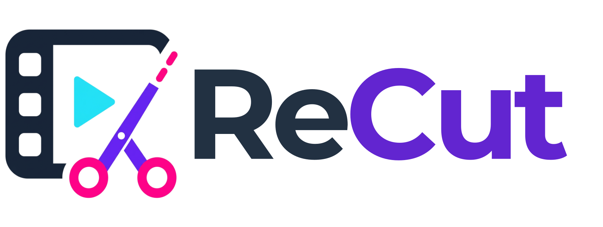

<div align="center">
  

  ### Clip any video. Instantly.

  [](https://svelte.dev/)
  [](https://fastapi.tiangolo.com/)
  [](https://tailwindcss.com/)
  [](https://daisyui.com/)
  [](https://www.docker.com/)

  <p align="center">
    A lightning-fast, modern web app to extract clips from videos instantly and <b>without re-encoding</b>.
  </p>
</div>

<hr />

## ✨ Features

- **⚡ Instant Clipping**: Extract video and audio segments instantly without re-encoding, preserving the original quality while drastically reducing processing time.
- **🌐 Broad Platform Support**: Leverages `yt-dlp` to fetch media metadata and content from hundreds of supported platforms (YouTube, Vimeo, Twitch, and more).
- **🎨 Modern & Responsive UI**: Clean, responsive, and beautiful interface built with Svelte 5, Tailwind CSS v4, and DaisyUI 5. Supports Light and Dark modes effortlessly.
- **🧹 Automatic Garbage Collection**: Background tasks automatically clean up old media files to prevent storage bloat on your server.
- **🐳 Containerized**: Designed for Docker Compose, isolating services for security, simplicity, and ease of deployment.

---

## 📸 Screenshots

> **Note**: Place your screenshots in the `assets/` folder at the root of the repository as `screenshot-pre.png` and `screenshot-post.png`.

| Before: URL Input & Setup | After: Clip Generation & Preview |
|:---:|:---:|
|  |  |

*(Screenshots showcasing the timeline selection UI and the generated clip preview)*

---

## 🏗️ Architecture

ReCut is composed of two loosely coupled services:

1. **Frontend (Web UI)**: A SvelteKit application handling the user interface, video timeline interactions, and API consumption.
2. **Backend (API)**: A Python FastAPI service handling the heavy lifting—extracting media streams natively with `yt-dlp` and cleanly slicing them with `ffmpeg`.

---

## 🚀 Getting Started (Docker Compose)

The recommended way to deploy ReCut is via Docker Compose. Below is a complete, well-commented configuration that sets up both the frontend and backend.

This configuration maps local host directories for both your downloaded clips and internal container data to guarantee persistence. 

> [!TIP]
> The backend uses `network_mode: "host"` to bypass DNS restrictions often found on strict routers and firewalls (like OpenWRT/Alpine). If your Docker host doesn't require this, you can switch back to standard bridge networking.

```yaml
services:
  backend:
    image: ghcr.io/g4s01/recut/backend:latest
    container_name: recut_backend
    restart: unless-stopped
    # FIX for OpenWRT / Alpine DNS issues: Uses the host's native networking and DNS
    network_mode: "host"
    # Note: Port mapping is ignored in host mode. The backend will run natively on port 8000.
    volumes:
      # Map a specific local directory for the extracted clips
      - ./my-clips:/app/downloads
      # Map a specific local directory for internal container data (e.g., yt-dlp cache)
      - ./backend-data:/app/data
    environment:
      - HOST=0.0.0.0
      - PORT=8000

  frontend:
    image: ghcr.io/g4s01/recut/frontend:latest
    container_name: recut_frontend
    restart: unless-stopped
    ports:
      - "3000:3000" # Format is HOST:CONTAINER. Change the left port to expose on a different host port.
    environment:
      # Point the frontend to the backend's external URL (or use default if not set)
      - PUBLIC_API_URL=${API_BASE_URL:-http://localhost:8000}
```

### Running the application

1. Save the configuration above as `docker-compose.yml` in a directory of your choice.
2. Run the following command to pull the images and start the containers in the background:

```bash
docker compose up -d
```

Once started:
- Access the **Web UI** at `http://localhost:3000` (or your custom port/domain).
- Access the **API Documentation** (Swagger UI) at `http://localhost:8000/docs`.

> [!NOTE]
> All processed clips will be safely stored in the `./my-clips` directory on your host machine. The backend's built-in garbage collector automatically removes media older than 2-3 hours to prevent storage bloat.

---

## 🛠️ Local Development

If you prefer to run the components directly on your host machine for development:

### Backend

Requires Python 3.10+, `ffmpeg`, and `yt-dlp` available in your system `PATH`.

```bash
cd backend
python -m venv venv
source venv/bin/activate
pip install -r requirements.txt
uvicorn main:app --reload
```

### Frontend

Requires Node.js 18+.

```bash
cd frontend
npm install
npm run dev
```
